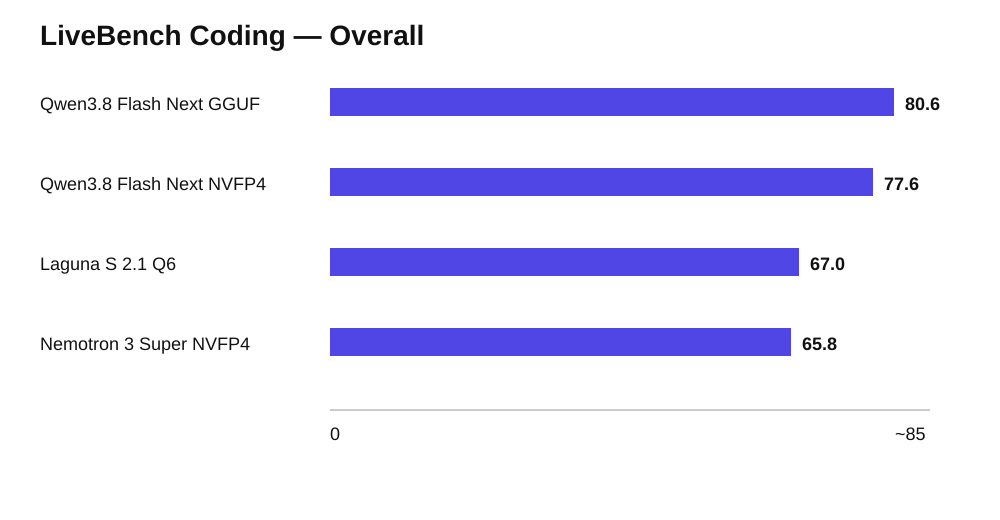
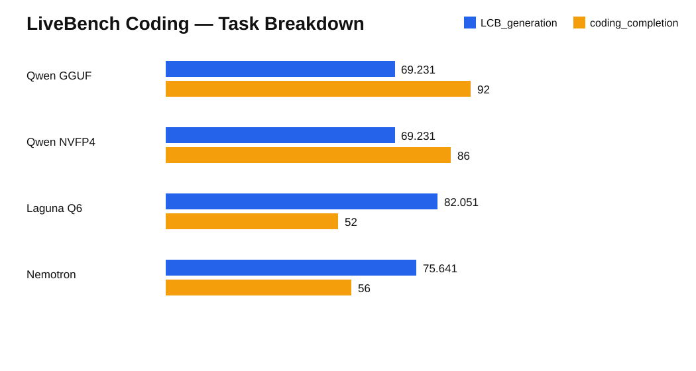
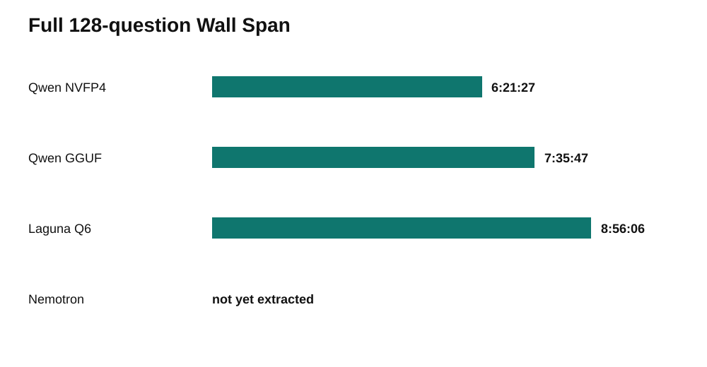

# Local Coding LLMs on an NVIDIA GB10 / DGX Spark-Class Computer

This benchmark tests large local coding LLMs on an **NVIDIA GB10 Grace Blackwell AI computer — the same core compute platform used by NVIDIA DGX Spark**.

The physical machine used for these tests is an **HP ZGX Nano G1n AI Station** (HP product CZ2V8UT#ABA). In practical terms, it is HP's OEM counterpart to NVIDIA DGX Spark: it uses the same NVIDIA GB10 Grace Blackwell Superchip, the same 128 GB coherent unified-memory architecture, NVIDIA DGX OS, and the same class of compact desktop AI-compute design.

HP product page:  
https://www.hp.com/us-en/shop/pdp/hp-zgx-nano-g1n-ai-station-p-cz2v8ut-aba-1

NVIDIA DGX Spark reference system:  
https://www.nvidia.com/en-us/products/workstations/dgx-spark/

So, throughout this report, **"GB10 system" means the NVIDIA GB10 / DGX Spark-class platform; our concrete unit is the HP ZGX Nano G1n implementation of that platform.**

### NVIDIA reference system vs. the HP system used here

> **Official manufacturer images — not AI-generated.**  
> Left: NVIDIA DGX Spark Founders Edition product image.  
> Right: HP's official product image for the HP ZGX Nano G1n.

<table>
  <tr>
    <td align="center" width="50%">
      
    </td>
    <td align="center" width="50%">
      
    </td>
  </tr>
  <tr>
    <td align="center"><strong>NVIDIA DGX Spark</strong><br><sub>Founders Edition product image</sub></td>
    <td align="center"><strong>HP ZGX Nano G1n</strong><br><sub>Exact OEM system family used for this benchmark</sub></td>
  </tr>
</table>

Official manufacturer websites:
- NVIDIA DGX Spark: https://www.nvidia.com/en-us/products/workstations/dgx-spark/
- HP ZGX Nano G1n: https://www.hp.com/us-en/shop/pdp/hp-zgx-nano-g1n-ai-station-p-cz2v8ut-aba-1

**Benchmark date:** September 2026  
**LiveBench release:** `2024-11-25`  
**Questions:** 128 total (`78 LCB_generation + 50 coding_completion`)  
**Client concurrency:** 4  
**Max output:** 32,768 tokens/request  
**Benchmark client:** separate Intel N150 mini-PC  
**Inference computer:** HP ZGX Nano G1n / NVIDIA GB10 Grace Blackwell / 128 GB unified memory

> Scope: these results describe this exact LiveBench Coding release, serving stack, quantization, sampling configuration and hardware. They are not a universal ranking of the models.



## Results

| Model | Backend | Quantization | Checkpoint size | Overall | LCB_generation | coding_completion | Wall span* |
|---|---|---|---:|---:|---:|---:|---:|
| Qwen3.8-Flash-Next GGUF | llama.cpp | UD-Q4_K_XL | 103.69 GiB | **80.6** | 69.231 | **92.0** | 7:35:47 |
| Qwen3.8-Flash-Next NVFP4 | vLLM | NVFP4 | not recorded | **77.6** | 69.231 | 86.0 | **6:21:27** |
| Laguna S 2.1 GGUF | llama.cpp | UD-Q6_K_XL | 99.73 GiB | 67.0 | **82.051** | 52.0 | 8:56:06 |
| NVIDIA Nemotron 3 Super | vLLM 0.27.1 | NVFP4 | 74.85 GiB | 65.8 | 75.641 | 56.0 | not yet extracted |

\* `Wall span` is measured from the first saved answer timestamp to the last saved answer timestamp, not from shell command start.



### Main observations

1. **Qwen3.8-Flash-Next GGUF had the best overall Coding score: 80.6.** Its strength came from `coding_completion=92.0`.
2. **Qwen NVFP4 was the fastest completed full run we measured** at a 6:21:27 answer-to-answer wall span, with an overall score of 77.6.
3. **Laguna S 2.1 was the strongest on generation-from-scratch** (`LCB_generation=82.051`) but fell to `52.0` on completion, producing a 67.0 overall score.
4. **Nemotron 3 Super was more balanced than Laguna on completion but still completion-limited**: `75.641 generation / 56.0 completion / 65.8 overall`.
5. The result shows why overall score alone can hide materially different coding behavior: Laguna and Nemotron beat Qwen on generation, while Qwen dominated code completion.



## Hardware

### NVIDIA GB10 / DGX Spark-class inference computer

The LLM inference machine is based on NVIDIA's **GB10 Grace Blackwell** desktop AI platform. NVIDIA's own implementation is the **DGX Spark**. Our unit is the **HP ZGX Nano G1n AI Station**, an OEM system built around the same GB10 Superchip and DGX software platform.

This distinction matters because the benchmark is fundamentally a test of what the **NVIDIA GB10 platform** can do locally; the box on our desk happens to be HP's implementation rather than an NVIDIA-branded DGX Spark.

#### Exact machine used

| Component | HP ZGX Nano G1n used in this benchmark |
|---|---|
| Product | **HP ZGX Nano G1n AI Station** |
| HP product number | **CZ2V8UT#ABA** |
| Compute platform | **NVIDIA GB10 Grace Blackwell Superchip** |
| CPU | **20-core Arm** — 10× Cortex-X925 + 10× Cortex-A725 |
| GPU | **NVIDIA Blackwell architecture** |
| AI performance | **Up to 1 PFLOP FP4 / 1,000 TOPS FP4** |
| System memory | **128 GB LPDDR5x coherent unified memory** |
| Memory interface | **256-bit** |
| Memory bandwidth | **273 GB/s** |
| Storage | **4 TB NVMe M.2 SSD** |
| Networking | **10 GbE RJ-45 + 2× QSFP up to 200 Gbps** |
| Wireless | **Wi-Fi 7** |
| Power supply | **240 W external USB-C adapter** |
| OS | **NVIDIA DGX OS (Ubuntu-based)** |
| Form factor | compact desktop, approximately **15 × 15 × 5.1 cm** |
| Weight | about **1.25 kg**, configuration-dependent |
| Benchmark API | OpenAI-compatible endpoint on port `3009` |
| Software observed during tests | CUDA 13.0; vLLM and llama.cpp depending on model |

Linux reported approximately **121 GiB usable RAM** from the nominal 128 GB coherent unified-memory pool.

The key property for these experiments is the **single 128 GB coherent memory pool shared by CPU and GPU**. That is what makes it possible to run ~75–104 GiB model checkpoints, large KV caches and 200k-class contexts on a tiny desktop system without a discrete-GPU VRAM boundary.

Official hardware references:

- HP ZGX Nano G1n: https://www.hp.com/us-en/shop/pdp/hp-zgx-nano-g1n-ai-station-p-cz2v8ut-aba-1
- HP technical specifications: https://support.hp.com/us-en/document/ish_13212147-13212192-16
- NVIDIA DGX Spark: https://www.nvidia.com/en-us/products/workstations/dgx-spark/

### Benchmark client

- Intel N150 mini-PC
- Ubuntu
- Docker
- LiveBench ran on the N150 and sent requests over the LAN to the GB10 host

Separating inference and benchmark orchestration avoided spending extra GB10 memory on the benchmark harness itself.

## Models

### Qwen3.8-Flash-Next

Official architecture: 125B language-model parameters with 6B activated per token, plus 51B n-gram embeddings and 4B MTP. Native context is 262,144 tokens.

Tested:
- NVFP4 via vLLM
- GGUF `UD-Q4_K_XL` via llama.cpp
- measured GGUF files: **103.69 GiB**

Official model card:
https://huggingface.co/Qwen/Qwen3.8-Flash-Next

### Laguna S 2.1

Laguna S 2.1 is a 118B total-parameter MoE model with 8B active parameters/token.

Tested:
- GGUF `UD-Q6_K_XL`
- llama.cpp
- measured files: **99.73 GiB**

Model card/source used for architecture reference:
https://huggingface.co/olka-fi/Laguna-S-2.1-MXFP4

### NVIDIA Nemotron 3 Super

NVIDIA Nemotron 3 Super is a 120B total / 12B active LatentMoE hybrid model.

Tested:
- NVIDIA NVFP4
- 17 weight shards
- measured checkpoint size: **74.85 GiB**
- vLLM image: `vllm/vllm-openai:v0.27.1`

Official model card:
https://huggingface.co/nvidia/NVIDIA-Nemotron-3-Super-120B-A12B-NVFP4

## Benchmark configuration

LiveBench:
https://github.com/LiveBench/LiveBench

```text
bench-name              live_bench/coding
release                 2024-11-25
questions               128
parallel requests       4
max output tokens       32768
streaming               disabled
resume                  enabled
incremental grading     disabled
request timeout         7200 s
```

### Per-model sampling

| Model | temperature | top_p | top_k | min_p | reasoning |
|---|---:|---:|---:|---:|---|
| Qwen3.8 Flash Next | 1.0 | 0.95 | 20 | default | `reasoning_effort=xhigh` |
| Laguna S 2.1 | 1.0 | 1.0 | 20 | 0.0 | thinking/default reasoning |
| Nemotron 3 Super | 1.0 | 0.95 | default | default | `enable_thinking=true`, `force_nonempty_content=true` |

For Nemotron, `temperature=1.0` and `top_p=0.95` follow NVIDIA's model-card recommendation.

## Throughput, thermals and memory observations

These are point samples from the runs, not integrated energy measurements.

| Model | Observed generation throughput | Temperature | Power |
|---|---:|---:|---:|
| Qwen NVFP4 | ~55.2 tok/s aggregate in a 4-request sample | — | — |
| Qwen GGUF | one long request observed at ~9.69 tok/s | — | — |
| Laguna Q6 | ~38–40 tok/s aggregate (~9.5–10.1/request) | 65–69°C | 48–54 W |
| Nemotron NVFP4 | ~44.8–45.2 tok/s aggregate (~11.2/request) | 63°C observed | 42 W observed |

### Nemotron memory behavior

At `262144 context × 4 sequences`, the server successfully initialized but left almost no host headroom:

```text
RAM used:      ~120 / 121 GiB
available:     ~1.2 GiB
swap used:     ~2.6 GiB
```

The full benchmark was run after reducing max context to approximately 200k while retaining four sequences:

```text
RAM used:      ~120 / 121 GiB
available:     ~0.8–1.0 GiB
swap occupied: ~2.8 GiB
```

`vmstat 1` showed essentially no active swap thrashing during inference: after the first cumulative line, `so` stayed at zero, `si` was generally 0–12 KiB/s, and `wa=0`.

The important distinction is that **swap was occupied, but was not continuously churned while four requests were generating**.

## Token accounting

For the runs where timing JSONL statistics were extracted:

| Model | Avg request | Sum request time | Output tokens |
|---|---:|---:|---:|
| Qwen NVFP4 | 11:46 | 25:06:05 | 1,563,453 |
| Qwen GGUF | 13:58 | 29:47:14 | 639,747 |
| Laguna Q6 | 16:41 | 35:35:33 | 1,227,729 |

**Do not interpret output-token totals across vLLM and llama.cpp as perfectly comparable.** Reasoning-token accounting can differ by backend and chat template.

## Reproduction

### 1. Start exactly one model server on the GB10 host

All tested servers exposed an OpenAI-compatible API on port `3009`.

Verify:

```bash
curl -s http://localhost:3009/v1/models | jq .
```

#### Laguna S 2.1 — retained command from the experiment

```bash
CTX_SIZE=204800 PARALLEL=4 \
/home/yurasik/infra/llama-gguf-experimental/start_laguna_s_2_1_ud_q6_k_xl.sh
```

Logs:

```bash
/home/yurasik/infra/llama-gguf-experimental/logs_laguna_s_2_1_ud_q6_k_xl.sh
```

Status:

```bash
/home/yurasik/infra/llama-gguf-experimental/status_laguna_s_2_1_ud_q6_k_xl.sh
```

#### Nemotron 3 Super — retained commands from the experiment

Initial memory test:

```bash
MAX_MODEL_LEN=262144 MAX_NUM_SEQS=4 \
/home/yurasik/infra/nemotron3-super/start-nemotron3-super.sh
```

Benchmark configuration:

```bash
MAX_MODEL_LEN=204800 MAX_NUM_SEQS=4 \
/home/yurasik/infra/nemotron3-super/start-nemotron3-super.sh
```

Operational scripts:

```text
/home/yurasik/infra/nemotron3-super/start-nemotron3-super.sh
/home/yurasik/infra/nemotron3-super/stop-nemotron3-super.sh
/home/yurasik/infra/nemotron3-super/status-nemotron3-super.sh
/home/yurasik/infra/nemotron3-super/logs-nemotron3-super.sh
```

The exact internal Qwen launcher scripts were not retained in the benchmark notes, so this repository deliberately does **not** fabricate them.

### 2. Verify memory before benchmarking

```bash
free -h
swapon --show
vmstat 1
```

For `vmstat`, watch `si`, `so`, and `wa`.

### 3. Run LiveBench from the N150

Copy/install `scripts/run-coding.sh` as `~/livebench/run-coding.sh`:

```bash
cd ~/livebench
./run-coding.sh all
```

Do **not** use the destructive reset script when adding another model. `--resume` allows multiple model results to coexist.

### 4. Grade existing answers

```bash
./scripts/grade-existing.sh <benchmark-model-id>
```

### 5. Extract timing/token stats

```bash
./scripts/collect-stats.sh <benchmark-model-id>
```

## Namespaced model-ID issue found during the Nemotron run

The server advertised:

```text
nvidia/nemotron-3-super
```

Using this exact string as the LiveBench local model identifier caused nested output paths such as:

```text
model_answer/nvidia/nemotron-3-super.jsonl
```

All 128 answers were generated successfully (`78 + 50`), but grading later reported:

```text
models: []
No question-answer pairs found
```

The publication runner in this repository fixes the problem by separating:
- API model name: exact server-side value (`nvidia/nemotron-3-super`)
- benchmark model id: namespace-stripped value (`nemotron-3-super`)

For legacy output, `scripts/repair-namespaced-model.sh` repairs the saved JSONL without regenerating inference.

## Interpretation

The main finding is the split between **generation** and **completion** behavior.

- Qwen's completion scores were dramatically stronger.
- Laguna had the best generation score.
- Nemotron's generation score was also above Qwen's, while completion remained much weaker.
- Qwen GGUF scored 3.0 points higher overall than Qwen NVFP4 in this run, while its measured wall span was ~19.5% longer.

For a coding agent that edits and continues existing code, `coding_completion` may be especially relevant. For feature generation or algorithmic tasks from a fresh prompt, `LCB_generation` may better resemble the workload. Repo-level agent benchmarks are still needed before generalizing these results to autonomous software-engineering performance.

## Limitations

- One physical GB10 system; no repeated-run confidence intervals.
- Different serving backends and quantizations.
- Token accounting differs across backends/templates.
- Thermals/power are point samples, not integrated energy measurements.
- Exact LiveBench source commit was not preserved; the release selector was `2024-11-25`.
- Nemotron full answer-to-answer timing JSONL summary still needs to be extracted.
- These are benchmark results, not claims about all coding workloads.

## Repository contents

```text
.
├── README.md
├── assets/
│   ├── overall-score.svg
│   ├── task-breakdown.svg
│   └── wall-time.svg
├── results/
│   ├── metadata.json
│   └── results.csv
├── scripts/
│   ├── run-coding.sh
│   ├── collect-stats.sh
│   ├── grade-existing.sh
│   ├── repair-namespaced-model.sh
│   └── reset-and-run-all.sh
└── posts/
    ├── linkedin.md
    ├── reddit.md
    └── nvidia-forums.md
```

## References

- LiveBench: https://github.com/LiveBench/LiveBench
- Qwen3.8-Flash-Next: https://huggingface.co/Qwen/Qwen3.8-Flash-Next
- NVIDIA Nemotron 3 Super NVFP4: https://huggingface.co/nvidia/NVIDIA-Nemotron-3-Super-120B-A12B-NVFP4
- Laguna S 2.1 architecture reference: https://huggingface.co/olka-fi/Laguna-S-2.1-MXFP4
